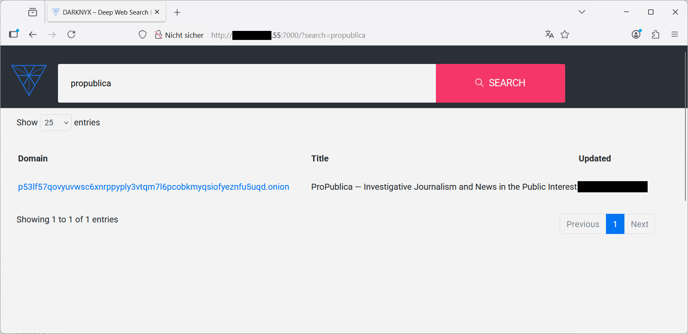

# Installation of the Project

This guide explains how to clone the repository, build the project, and run the services inside your Proxmox LXC container.  

---

## Table of Contents
1. [Clone the Repository](#step-1-clone-the-repository)  
2. [Build the Base Infrastructure](#step-2-build-the-base-infrastructure)  
3. [Access the Web Interfaces](#step-3-access-the-web-interfaces)  
4. [Build and Run the Scraper](#step-4-build-and-run-the-scraper)  
5. [Start Scraping URLs](#step-5-start-scraping-urls)  
6. [View Results](#step-6-view-results)  

---

## Step 1: Clone the Repository

Clone the project repository:  

```bash
git clone https://github.com/sdierkes/Darkweb-search-engine-proxmox.git
cd Darkweb-search-engine-proxmox/
```


---

## Step 2: Build the Base Infrastructure

Build the Docker containers:  

```bash
sudo docker-compose build
```


Start the base infrastructure (without the scraper):  

```bash
sudo docker-compose up -d
```


---

## Step 3: Access the Web Interfaces

Find the container’s IP address (assuming `eth0` was chosen as NIC):  

```bash
ifconfig -a eth0
```

In your browser, access:  
- Web-GUI: `http://<IP-Address>:7000/`  
- Kibana: `http://<IP-Address>:5601/`  

> 💡 If you have a working DNS, you may also use the hostname `dwse` with your local domain.  

Example Web-GUI:  


---

## Step 4: Build and Run the Scraper

Ensure you are in the base project directory and run:  

```bash
sudo docker build --tag scraper_crawler ./
```

Start the scraper:  

```bash
sudo docker run -d --name darkweb-search-engine-onion-crawler --network=dwse-net scraper_crawler /opt/torscraper/scripts/start_onion_scrapy.sh
```

Set up the Elasticsearch indexes (this may take some time):  

```bash
sudo docker exec darkweb-search-engine-onion-crawler /opt/torscraper/scripts/elasticsearch_migrate.sh
```

You can check the indices in Kibana:  


---

## Step 5: Start Scraping URLs

Start scraping a list of URLs (the included list contains only one entry: the ProPublica onion address):  

```bash
sudo docker exec darkweb-search-engine-onion-crawler /opt/torscraper/scripts/push_list.sh /opt/torscraper/onions_list/onions.txt
```

> ⚠️ On the first call you might see errors when attempting to fetch TLD information from the internet. Since this project focuses on **.onion sites**, these errors can be safely ignored.  

---

## Step 6: View Results

Direct your browser to search for “propublica”:  

```
http://<IP-Address>:7000/?search=propublica
```

Example results:  



---

## Done!

Your setup is complete. 🎉  

Now it’s up to you to extend the list of onion entry points you are interested in.  
Additional hints and guidance for working with this installation may be provided in future updates.  

---

## Navigation

- ⬅️ [Previous: Install and Configure Docker](./INSTALL-DOCKER.md)  
- ➡️ Next: *(to be added in upcoming documentation)*  
