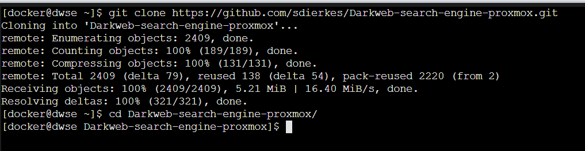

# Installation of the project

## Get the repo for the Darkweb-search-engine

Clone repository

    git clone https://github.com/sdierkes/Darkweb-search-engine-proxmox.git

and change directory

    cd Darkweb-search-engine-proxmox/

  

    sudo docker-compose build

  

There shouldn't be any errors, now we can start the base infrastructure of the project without the scraper.

    sudo docker-compose up -d

  

Now you should be able to connect to search engine Web-GUI and kibana within your local network. 
To get the ip address of your server/container you might use (assuming during container installation you choose eth0 as nic)

    ifconfig -a eth0

In the output you should see the ip adress of your server and you might now point your browser to

* for Web-Gui: http://IP-Adress:7000/
* for Kibane: http://IP-Adress:5601/

if you have a working DNS you might also be able to use the hostname "dwse" with your local domain.
The Web-GUI shoild look like

  

## Build the Scrapper and start it

Make sure you are in the base directory of the project and run

    sudo docker build --tag scraper_crawler ./

and start it 

    sudo docker run -d --name darkweb-search-engine-onion-crawler --network=dwse-net scraper_crawler /opt/torscraper/scripts/start_onion_scrapy.sh

afterwards we need to set up the right indexes in elasticsearch (might take some time), you could check the index with the kibana container

  

and finally we start the scraping a list of urls. The list within this project only holds one URL, i.e. the onion adress of probulica.

