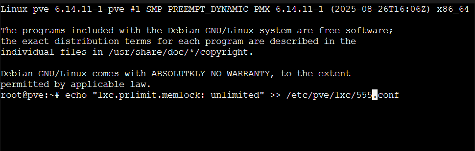

## Change container settings on the Proxmox Server

For the ELK stack a manual change must be made in the containers configuration file.
Therefore open shell on the Hostsystem, i.e. the machine running Proxmox and apply:

    echo "lxc.prlimit.memlock: unlimited" >> /etc/pve/lxc/777.conf

  

Change the file name "555.conf" if you don't use 555 as id for your container.
Now configuration is done, and the container can be started.
[prvious step](./INSTALL-CONTAINER.md)
