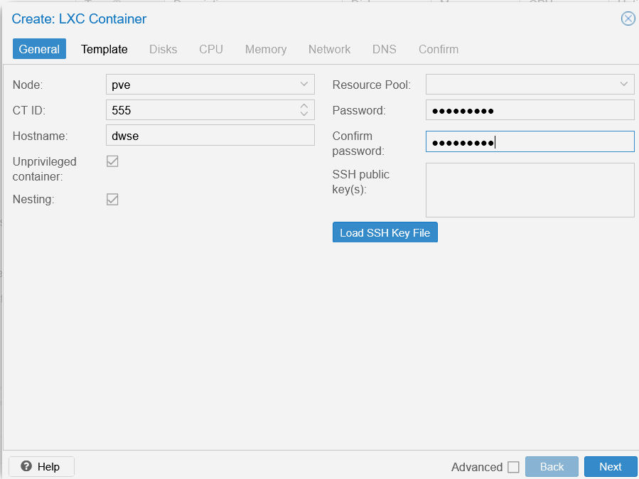
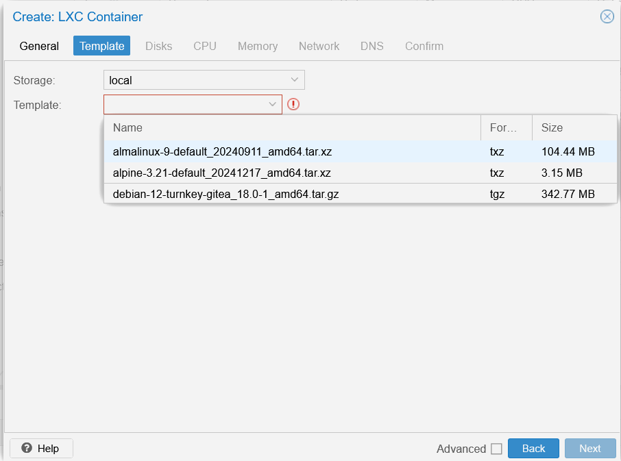
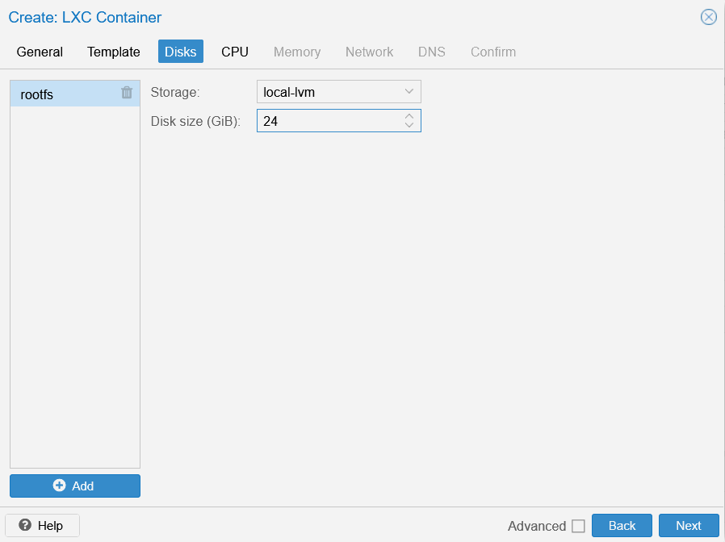
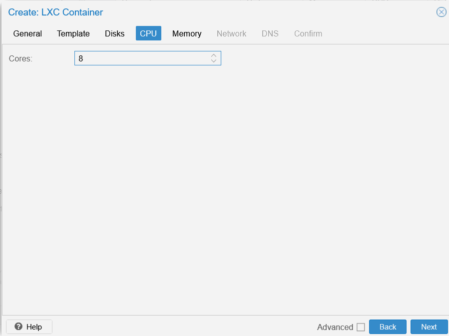
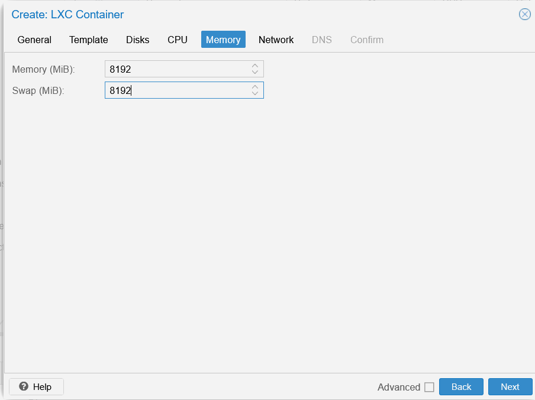
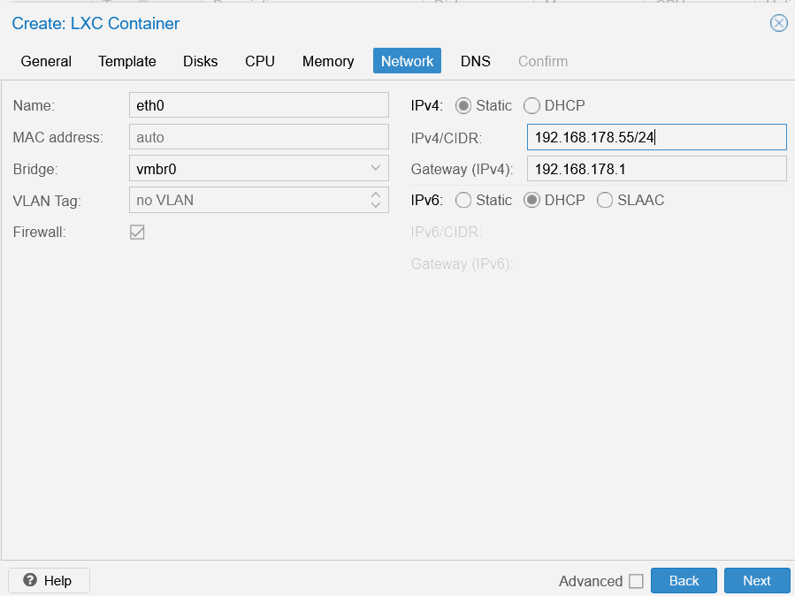
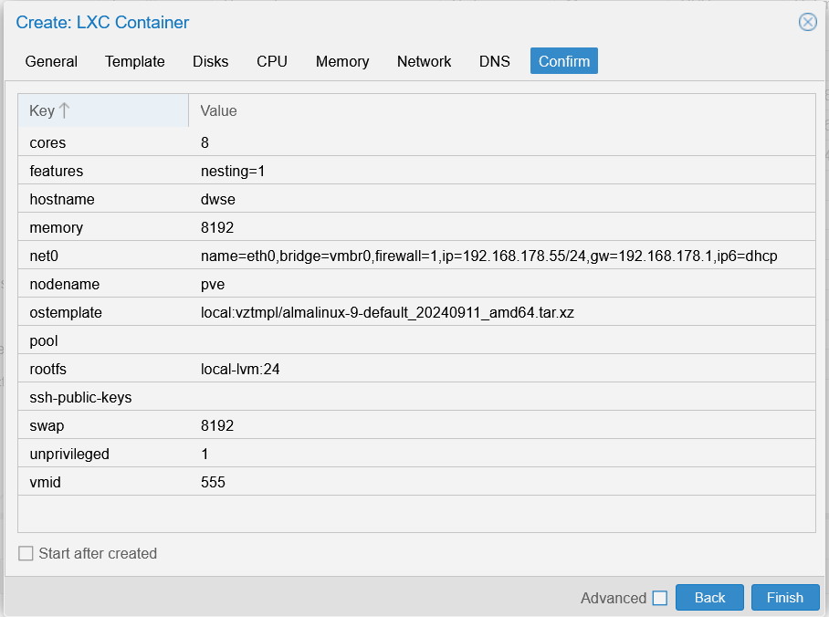

# Proxmox LXC Installation Guide

This guide explains how to create an **AlmaLinux LXC container** in Proxmox as the base for a Docker installation.  

---

## Step 1: Download the AlmaLinux Template

Download the latest AlmaLinux LXC template via the **Proxmox GUI**.  

  

---

## Step 2: Create a New Proxmox Container (CT)

When creating the container, configure the following settings (examples are provided; adjust as needed):  

- **Name:** `dwse`  
- **ID:** `555`  

  

- **Template:** AlmaLinux 9  

  

- **Local Storage:** Choose based on expected workload.  
  - For heavy use with **ELK Stack** and scrapers, allocate sufficient space.  
  - Example: `24 GB`  

  

- **CPU Cores:** Scrapers require processing power.  
  - Example: `8` cores  

  

- **Memory / Swap:** ELK is memory intensive.  
  - Minimum: `8 GB`  
  - Recommended: `16 GB`  

  

- **Network:**  
  - Example: **DHCP** (depending on your environment)  
  - ⚠️ You must know the NIC device name (assume `eth0` in this example).  
  - Optional static IP: `192.168.178.55`  

  

---

## Step 3: Review the Summary

  

---

## ⚠️ Important Notice

Before starting the container, you must **update the Proxmox host configuration** for this CT.  

👉 Continue with the next step: [Adjust Memory Lock Settings](INSTALL-ADJUST-MEMLOCK.md)  
