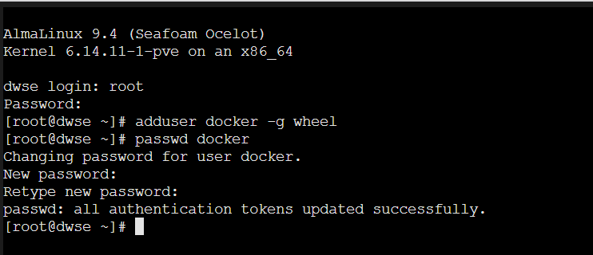
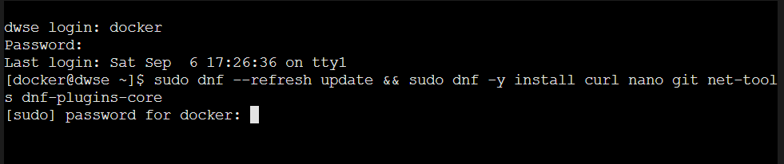
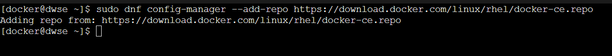
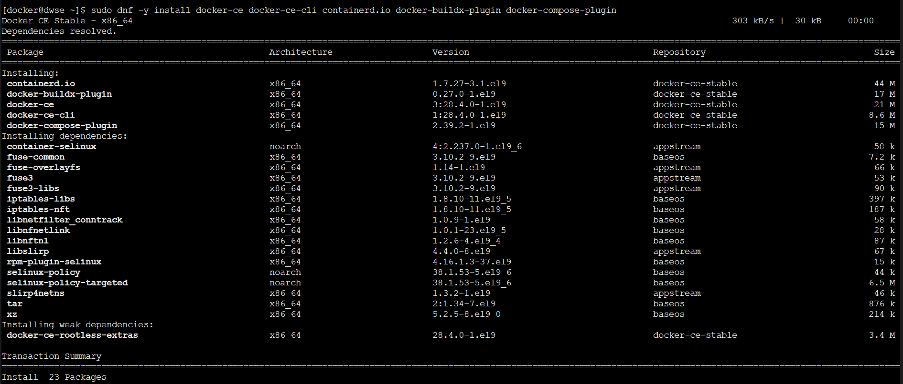
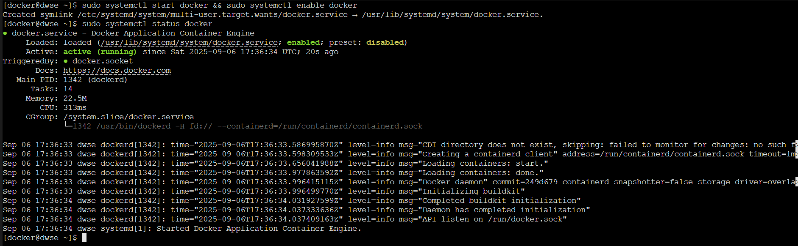
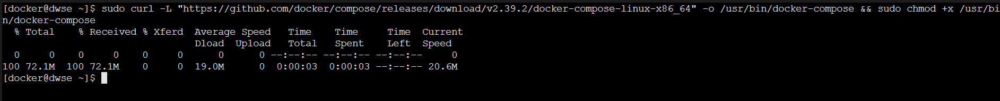

# Install and Configure Docker in the Container

This guide covers installing Docker inside your Proxmox LXC container and preparing it for further setup.

---

## Table of Contents
1. [Verify memlock Settings](#step-1-verify-memlock-settings)  
2. [Optional: Create a Non-Root User](#step-2-optional-create-a-non-root-user)  
3. [Update System and Install Tools](#step-3-update-system-and-install-tools)  
4. [Install Docker](#step-4-install-docker)  
   - [4.1 Add Docker Repository](#41-add-docker-repository)  
   - [4.2 Install Docker Packages](#42-install-docker-packages)  
   - [4.3 Start and Enable Docker](#43-start-and-enable-docker)  
   - [4.4 Verify Docker Status](#44-verify-docker-status)  
5. [Install Docker Compose](#step-5-install-docker-compose)  
6. [Next Step](#next-step)

---

## Step 1: Verify memlock Settings

Log in to the container console as **root** and check the `ulimit` setting for memlock (required by the ELK stack):

```bash
ulimit -l
```

Expected output:

```
unlimited
```

> ⚠️ If the output is different (e.g., `8192`), verify that the container configuration file was updated correctly in the [previous step](INSTALL-ADJUST-MEMLOCK.md):  
> - Was the **correct filename** used (matching your CT ID)?  
> - Was the **correct key–value pair** added?

---

## Step 2: Optional: Create a Non-Root User

For security and convenience, create a non-root user (e.g., `docker`) with sudo rights:

```bash
adduser docker -g wheel
passwd docker
```



---

## Step 3: Update System and Install Tools

Log in as the newly created user (`docker`) and update the system. Install required tools for later steps:

```bash
sudo dnf --refresh update && sudo dnf -y install curl nano git net-tools dnf-plugins-core
```



---

## Step 4: Install Docker

### 4.1 Add Docker Repository

```bash
sudo dnf config-manager --add-repo https://download.docker.com/linux/rhel/docker-ce.repo
```



### 4.2 Install Docker Packages

```bash
sudo dnf -y install docker-ce docker-ce-cli containerd.io docker-buildx-plugin docker-compose-plugin
```



### 4.3 Start and Enable Docker

```bash
sudo systemctl start docker && sudo systemctl enable docker
```

### 4.4 Verify Docker Status

```bash
sudo systemctl status docker
```



---

## Step 5: Install Docker Compose

Download Docker Compose (replace the version with the latest release if needed) and make it executable:

```bash
sudo curl -L "https://github.com/docker/compose/releases/download/v2.39.2/docker-compose-linux-x86_64" -o /usr/bin/docker-compose
sudo chmod +x /usr/bin/docker-compose
```



---

## Next Step

👉 Continue with: [Get Repository and Build Everything](./GET-REPOSITORY.md)

[previous step](./INSTALL-ADJUST-MEMLOCK.md)

