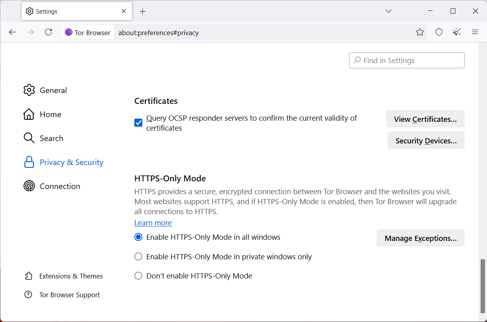
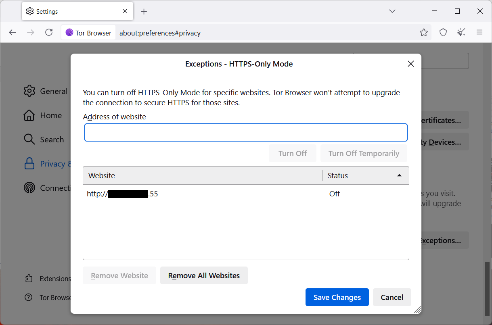
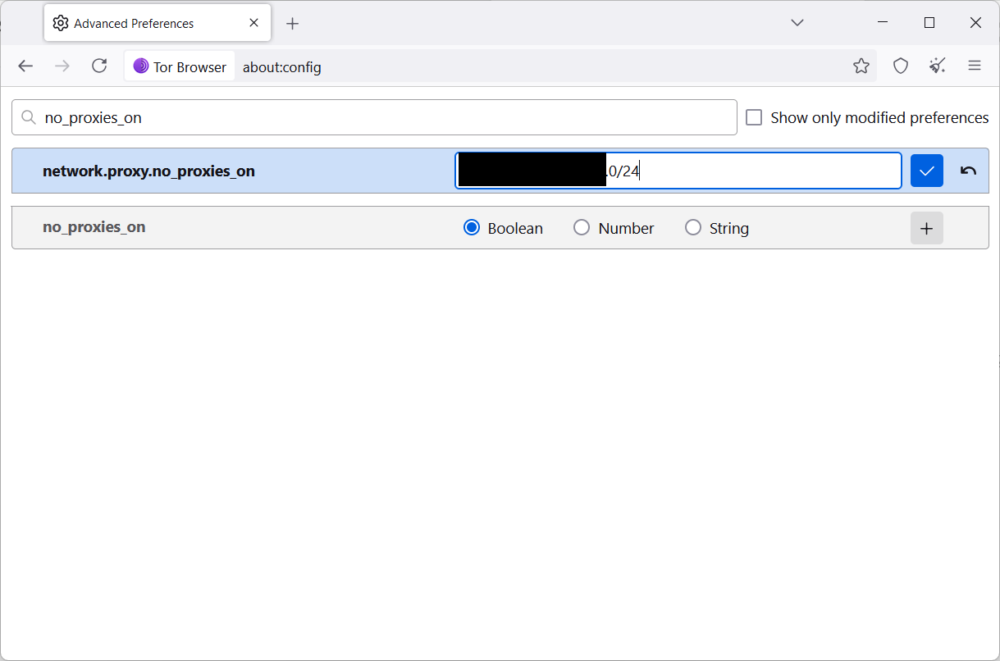

# Usage Notes

This document explains how to correctly use the search engine’s web interface with the **Tor Browser**.  

---

## Table of Contents
1. [Background](#background)  
2. [Allow HTTP Requests](#step-1-allow-http-requests)  
3. [Disable Proxy for Local Network](#step-2-disable-proxy-for-local-network)  

---

## Background

If you open the search engine interface in a normal browser, the links on the results page will **not work**.  
This is because the results are **.onion links** that require access to the Tor network.  

To view these links, you need to use the **Tor Browser**. However, the Tor Browser by default does not allow access to local network addresses (where the search engine is running). Therefore, a few configuration changes are required.  

> 💡 The following screenshots were taken from the Tor Browser for Windows. The steps are similar on other platforms.  

---

## Step 1: Allow HTTP Requests

By default, the Tor Browser only allows **HTTPS** connections.  
Since the search engine runs in **HTTP mode** (unless you configured HTTPS), you must explicitly allow HTTP requests.  

1. Open:  
   **Settings → Privacy and Security → Manage Exceptions**  

   

2. Add the IP address of your search engine to the exception list and save:  

   

---

## Step 2: Disable Proxy for Local Network

By default, the Tor Browser routes **all traffic** through the Tor network.  
To reach your local network (where the search engine is hosted), you need to exclude it.  

1. Enter the following in the address bar:  

    about:config

2. Accept the risk warning.  
3. Search for `no_proxies_on`.  
4. Edit the entry to include your local network range (CIDR mask). Example:  

---

✅ After applying these changes, you can use the Tor Browser to access the local search engine and follow `.onion` links from the results page.  
